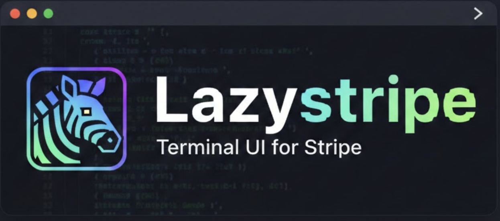

# 🦓 Lazystripe



**Lazystripe** is a powerful Terminal UI (TUI) for Stripe, designed for developers who want to manage their balances, customers, and transactions without leaving the command line.


[](https://asciinema.org/a/8fiZSBQoqbsUWZkY2ivGYHnnx)

---

## Quick Start

### Prerequisites

* **Go 1.21+** installed ([Download Go](https://golang.org/dl/))
* A **Stripe Secret API Key**

### Installation

Install the binary directly to your `$GOPATH/bin`:

```bash
go install github.com/soub4i/lazystripe/cmd/lazystripe@latest

```

### Configuration

Initialize the tool with your Stripe API key. This creates a config file at `~/.lazystripe/config`.

```bash
lazystripe init <your_stripe_api_key>

```

---

## ⌨️ TUI Keybindings

Once inside the interface, use these shortcuts to navigate your Stripe data:

| Key | Action |
| --- | --- |
| `m` | **Focus Menu** - Switch focus to the sidebar |
| `p` | **Focus Main** - Switch focus to the content area |
| `b` | **Balance** - View account balances |
| `c` | **Customers** - List customers (`Enter` for details) |
| `t` | **Transactions** - View payments (`Enter` for details) |
| `r` | **Products** - List products & prices (`Enter` for details) |
| `d` | **Donate** - Support the project |
| `q` | **Quit** - Exit Lazystripe |

---

## CLI Commands

### `run` (or just `lazystripe`)

Launches the interactive TUI.

```bash
lazystripe run

```

### `init`

Sets up your API credentials.

```bash
lazystripe init sk_test_51Mz...

```

### `version`

Check your current version and the Stripe API version being utilized.

```bash
lazystripe version

```

---

## Building from Source

If you want to contribute or build manually:

1. **Clone the repo:**
```bash
git clone https://github.com/soub4i/lazystripe.git
cd lazystripe

```


2. **Build:**
```bash
go build -o lazystripe ./cmd/lazystripe

```


3. **Run locally:**
```bash
./lazystripe

```


---

## License

This project is licensed under the **MIT License**.

